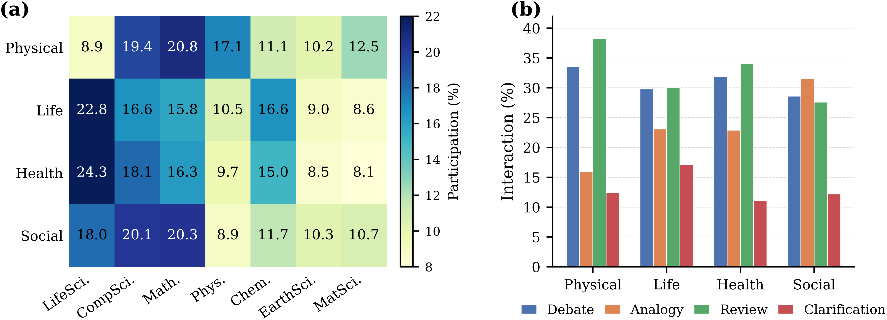

# SciNexus

## Repository layout

```text
SciNexus/
├── main.py                         # pretrain, train_rl, run, comparator commands
├── config.py                       # Model/training configuration and path validation
├── paths.py                        # Package-relative paths and environment variable names
├── reward.py                       # Step and terminal reward computation
├── agents/                         # Scientific expert agents
├── graph/                          # Graph state and routing policy
├── environment/                    # Multi-agent discourse environment
├── training/                       # Behavior cloning and PPO trainers
├── comparator/                     # SciComp training, inference, and evaluation
├── baseline/evaluation/            # Cross-encoder and LLM-judge evaluation utilities
├── data/comparator_sample200/      # sampled preference pairs
├── pretrain_data/paper_datasets/
│   └── pretraindataset.jsonl       # dataset for pretrain & rl
├── bench/
│   └── interdisciplinary_bench.jsonl  # benchmark
└── image/                          # Architecture and case-study figures
```

The record counts above describe the files in this repository snapshot.

## Installation

Run commands from the directory that contains the `SciNexus/` package directory:

```bash
python -m venv .venv
source .venv/bin/activate
pip install -r SciNexus/requirements.txt
```


## Configuration

Secrets and external model locations are not stored in the repository. Configure only the variables needed by the command you run:

| Variable | Used for |
| --- | --- |
| `OPENAI_API_KEY` | Expert-agent LLM calls during inference and PPO rollouts |
| `OPENAI_BASE_URL` | Optional OpenAI-compatible API endpoint |
| `SENTENCE_MODEL_PATH` | Local sentence-transformer model for router input embeddings |
| `QWEN_BASE_MODEL_PATH` | Local Qwen2.5-7B-compatible base model for SciComp |
| `COMPARATOR_INIT_LORA` | Optional initial LoRA checkpoint for SciComp training |
| `TASK_DATA_PATH` | Optional external task dataset |
| `PDF_DIR`, `PDF_RESULTS_PATH` | Optional paper-processing inputs |
| `TOPIC_DOMAINS_FILE` | Optional topic/domain metadata JSONL |
| `CROSSENCODER_MODEL_PATH` | Cross-encoder used by baseline evaluation |
| `EVAL_METADATA_PATH` | Abstract/metadata JSONL used by baseline evaluation |

## Command-line workflows

### 1. Train SciComp

Jointly train LoRA parameters and the FWCI regression heads:

```bash
python -m SciNexus.main train_comparator \
  --train-data data/comparator_sample200/train.jsonl \
  --test-data data/comparator_sample200/test_2024.jsonl \
              data/comparator_sample200/test_2025.jsonl \
  --base-model "$QWEN_BASE_MODEL_PATH" \
```

Default outputs are written below `SciNexus/checkpoints/`, including the regression head and LoRA adapter. Evaluate a trained comparator with:

```bash
python -m SciNexus.main eval_comparator \
  --test-data data/comparator_sample200/test_2024.jsonl \
              data/comparator_sample200/test_2025.jsonl \
  --base-model "$QWEN_BASE_MODEL_PATH" \
  --output results/comparator_eval.json
```

### 2. Initialize the router with behavior cloning

```bash
python -m SciNexus.main pretrain
```

This command expects generated trajectories at `SciNexus/pretrain_data/trajectories/pretrain_trajectories.jsonl` and writes Phase 1 checkpoints under `SciNexus/checkpoints/`.

### 3. Optimize the router with PPO

```bash
python -m SciNexus.main train_rl 
```


## Interaction patterns and examples

SciNexus represents disciplinary collaboration through typed interactions. The figures below illustrate the interaction analysis and two generated case studies included with the repository.



### Case study 1: Mixture of Chemical Experts

Domain experts propose a Mixture of Chemical Experts model that combines Pauling electronegativity and the van Arkel–Ketelaar triangle as routing constraints.


### Case study 2: Micro-Execution Sandbox

Experts propose a micro-execution sandbox combining invariant verification with topology-preserving stratified micro-sampling for deterministic workflow validation.


